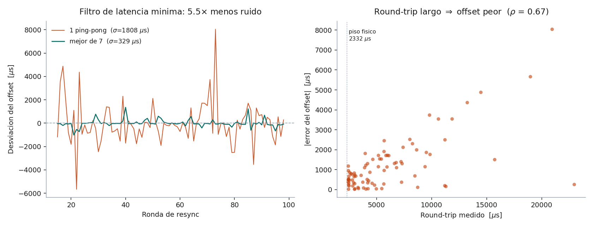
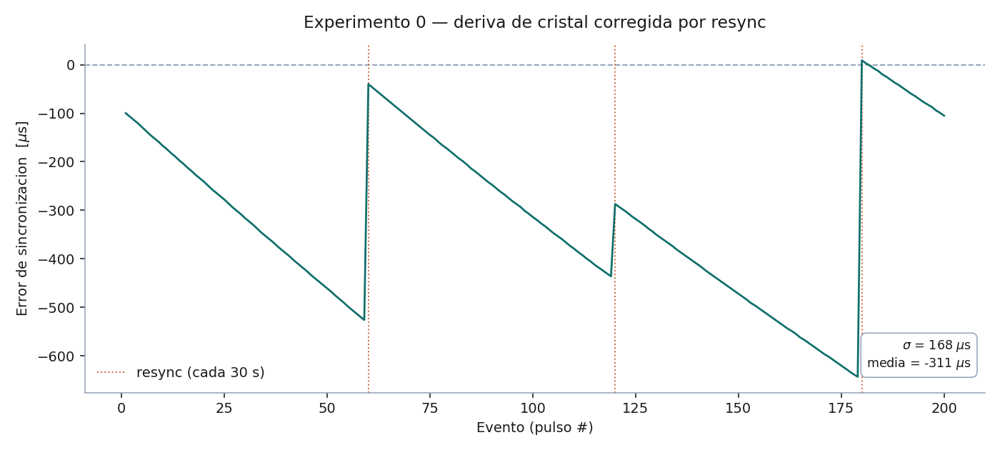
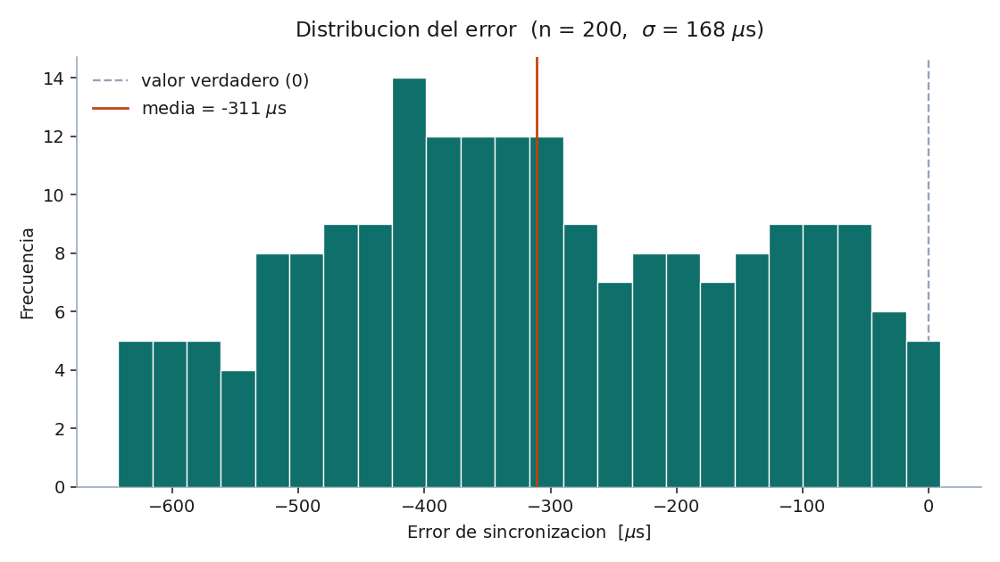
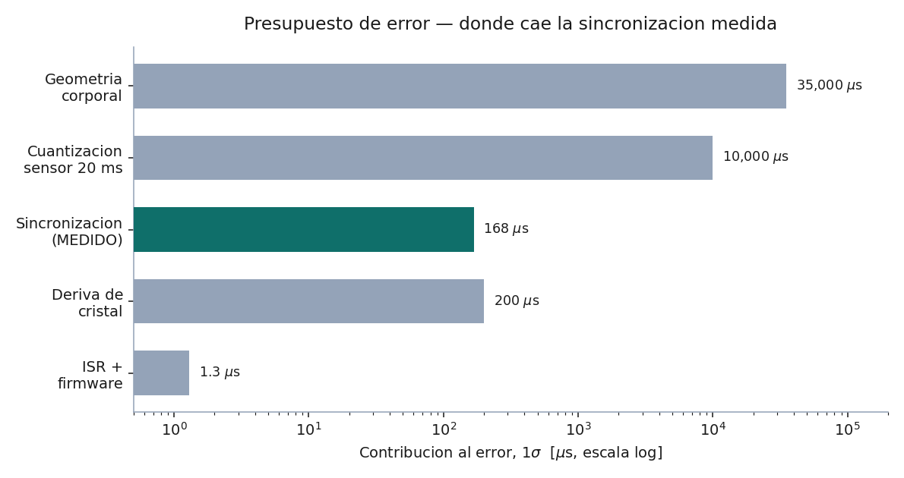

# Experimento 0 — Jitter de la infraestructura de tiempo

**Resultado:** σ = **168 µs** (0.17 ms) · REQ-NF-02 pedía ≤ 5 ms · **margen de 30×** · Estado: **APROBADO**

---

## 1. Objetivo

Cuantificar el error introducido por la sincronización de relojes y el timestamping, aislado de cualquier efecto del sensor, para validar empíricamente la arquitectura de **timestamp distribuido** (ADR-003) antes de comprometer recursos en fabricación de PCB.

La afirmación bajo prueba: *la latencia variable del enlace inalámbrico no contamina la medición, porque el instante se congela localmente en el nodo antes de que el paquete salga.*

## 2. Principio metrológico

Para medir el error de un sistema se requiere una referencia más exacta que el sistema medido. Se usa un **evento eléctrico compartido por cable**: llega a ambos microcontroladores en nanosegundos, seis órdenes de magnitud por debajo del error buscado.

El valor verdadero de la diferencia entre ambos timestamps es **cero por construcción**. Todo lo que no sea cero es error del sistema.

## 3. Montaje

| Señal | Nodo A | Nodo B |
|---|---|---|
| Pulso (salida) | GPIO4 | — |
| Pulso (entrada) | GPIO16 | GPIO16 |
| Tierra | GND | GND (unida a A) |

- GPIO4 de A → resistencia 330 Ω → bifurcación a GPIO16 de A y GPIO16 de B
- Tierra común obligatoria entre ambas placas
- Hardware: 2× ESP32-WROOM-32U con antena externa SMA
- Disparo por firmware (no botón mecánico): evita rebotes y permite automatizar
- Verificación previa del cableado con analizador lógico a 1 MHz: tres canales con flanco alineado

## 4. Protocolo de sincronización

### 4.1 Cálculo del offset

Intercambio ping-pong de cuatro timestamps por ESP-NOW:

$$\text{offset} = \frac{(t_2 - t_1) + (t_3 - t_4)}{2} \qquad \text{delay} = (t_4 - t_1) - (t_3 - t_2)$$

La formulación cancela la latencia del enlace siempre que ida y vuelta sean simétricas.

### 4.2 Filtro de latencia mínima

La versión inicial usaba un solo ping-pong cada 30 s y arrojó σ = 1.8 ms. Se identificó que el ruido no era ambiental sino del protocolo: **la asimetría entre ida y vuelta entra directo al offset calculado**.

Justificación formal del filtro: si existe un piso físico de transmisión `F`, y el round-trip medido es `D`, entonces el error máximo por asimetría está acotado por:

$$\text{error}_{\max} = \frac{D - F}{2}$$

Un round-trip cercano al piso **garantiza** que ninguna dirección se atoró mucho. Con `F = 2332 µs` medido:

| Caso | Round-trip | Cota de error |
|---|---|---|
| Filtrado (mediana) | 2 483 µs | **±75 µs** |
| Sin filtrar (mediana) | 4 746 µs | ±1 207 µs |
| Peor ronda observada | 22 962 µs | ±10 315 µs |

**Implementación:** ráfaga de 7 ping-pongs separados 20 ms; se conserva el de menor `delay` y **se descartan los otros seis**. Se descarta en lugar de promediar porque un promedio arrastraría las muestras con cota de ±10 ms.

Es la misma técnica que usa NTP desde hace décadas, por el mismo argumento.

**Validación empírica:** σ pasó de 1 808 µs a 329 µs (**mejora de 5.5×**), y la correlación entre round-trip medido y error del offset resultó **ρ = 0.67** — las rondas con enlace lento son efectivamente las que producen offsets desviados.

## 5. Procedimiento

1. Handshake de arranque: A completa el primer resync, envía mensaje de reset a B, ambos ponen contadores en cero y adjuntan sus ISR
2. A genera 200 pulsos, uno cada 500 ms (lockout de 50 ms por flanco)
3. Cada nodo captura su timestamp en la ISR **como primera instrucción**
4. B transmite su timestamp por ESP-NOW con número de secuencia
5. A aplica el offset vigente y calcula: `resultado = tA − (tB − offset)`
6. Resync cada 30 s, en segundo plano, independiente del flujo de eventos

**Control de versiones de esta corrida:** 200/200 eventos registrados, cero pérdidas.

## 6. Resultados

La gráfica muestra el mecanismo completo en operación: la deriva de cristal acumulándose linealmente y el resync corrigiéndola cada 30 segundos (seq 60, 120, 180).

### 6.1 Descomposición del error

| Componente | Magnitud (1σ) | Origen |
|---|---|---|
| **Jitter puro de captura** | **1.3 µs** | ISR + timestamping |
| Deriva entre resyncs | 400–650 µs pico | Cristal, 11.4–14.7 µs/s |
| Error de estimación del offset | ~200 µs | Asimetría residual del ping-pong |
| **Total medido** | **168 µs** | |

### 6.2 Deriva de cristal por bloque

| Bloque | Pulsos | Deriva medida | σ residual |
|---|---|---|---|
| seq 1–59 | 59 | −14.7 µs/s | 1.0 µs |
| seq 60–119 | 60 | −13.5 µs/s | 1.7 µs |
| seq 120–179 | 60 | −12.1 µs/s | 1.4 µs |
| seq 180–200 | 21 | −11.4 µs/s | 0.4 µs |

**Validación cruzada:** la deriva medida aquí (11.4–14.7 µs/s) coincide con los 14.2 µs/ronda obtenidos en la caracterización del resync por un método independiente. Dos experimentos distintos convergen al mismo valor físico.

La distribución no es gaussiana sino aproximadamente uniforme. Esto es consecuencia directa del patrón de diente de sierra: los valores se reparten a lo largo de la rampa de deriva en vez de concentrarse alrededor de un centro. La forma de la distribución identifica cuál mecanismo domina el error.

La media de −311 µs no es un sesgo del sistema sino un artefacto geométrico: la rampa siempre cae hacia el mismo lado entre correcciones.

## 7. Contexto en el presupuesto de error

| Fuente | Estimado (v2.0) | Medido |
|---|---|---|
| Geometría corporal | ±20–50 ms | — (dominante, irreducible) |
| Cuantización del sensor | ±10 ms | pendiente (Exp. 1) |
| **Sincronización entre nodos** | **±1–2 ms** | **±0.17 ms** |
| Latencia del enlace de radio | 0 ms | confirmado 0 |

La sincronización resultó **un orden de magnitud mejor que lo presupuestado**, y queda dos órdenes de magnitud por debajo del error dominante.

## 8. Conclusiones

1. **La arquitectura de timestamp distribuido queda validada.** El jitter puro de captura es de 1.3 µs; la latencia del radio no entra en la medición, tal como predice ADR-003.

2. **ADR-007 (enlace inalámbrico) queda reforzado.** El documento estimaba que cablear eliminaría 1–2 ms, equivalente al 3 % del error total. La medición real es de 0.17 ms — el beneficio de cablear sería aún menor de lo estimado, y el costo (80 m de cable, violación de REQ-NF-04) permanece igual.

3. **El error residual es de mantenimiento de offset, no de captura.** Si en el futuro se requiriera más precisión, la vía es compensar la deriva linealmente entre resyncs, no mejorar el timestamping.

4. **Camino libre para el Experimento 1.** Con la contribución de la infraestructura cuantificada en 168 µs, la varianza del sensor podrá aislarse restando en cuadratura.

## 9. Incidencias resueltas durante la ejecución

| Síntoma | Causa raíz | Solución |
|---|---|---|
| Desfase constante de exactamente 2 s (4 pulsos) | B contó flancos espurios durante el arranque, con GPIO flotante mientras A booteaba | Handshake de arranque: las ISR se adjuntan solo después de que A confirma el primer resync |
| σ de 1.8 ms en el resync | Asimetría ida/vuelta del ping-pong | Filtro de latencia mínima sobre ráfaga de 7 |
| Corrupción de caracteres en salida serial | Baudrate insuficiente | 921 600 baud + impresión diferida al final de la corrida |
| Hipótesis de interferencia RF (Bluetooth, WiFi) | Descartada experimentalmente | σ sin cambio al apagar bocina y radios de la computadora (2.00 → 2.26 → 2.14 ms) |

La hipótesis de interferencia ambiental se probó y **se descartó con datos**. Esto redirigió el esfuerzo hacia el protocolo, que era la causa real.

## 10. Archivos

| Archivo | Contenido |
|---|---|
| `exp0_datos.csv` | 200 eventos: seq, resultado_us, offset_us |
| `graficar.py` | Genera las gráficas 01–03 |
| `graficar_p3.py` | Genera la gráfica 04 |
| `01_serie_temporal.png` | Diente de sierra con marcas de resync |
| `02_histograma.png` | Distribución del error |
| `03_presupuesto_error.png` | Contexto en el presupuesto (escala log) |
| `04_filtro_latencia.png` | Validación del filtro de latencia mínima |
